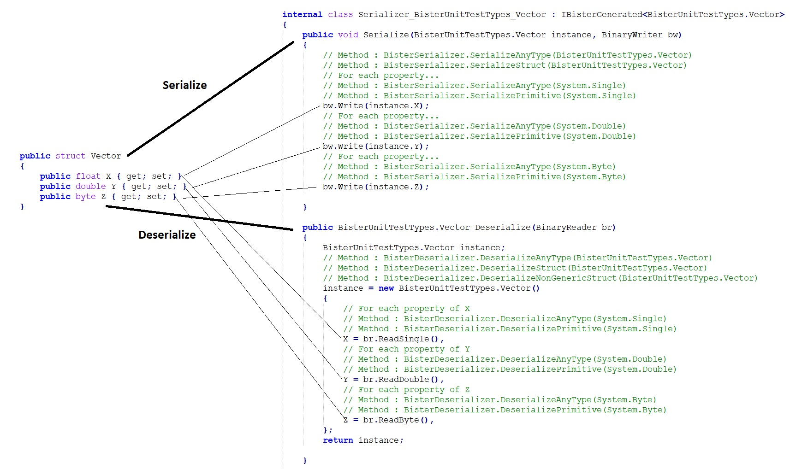

# Bister

A high performing binary serializer for C#, but unlike other serializers - Bister is non intrusive! 
Bister doesn't require you to add any attributes to your type, while not compromising on performance.

* No special attributes required! Bister serializes public properties
* Comparable or better performance to other serializers
* Better type coverage than both System.Text.Json and Newtonsoft (For example: Ability to handle System.Object and System.Enum fields which types are known only in run time)
* Ability to handle any type derived from IEnumerable, with optimzied implementation for the popular ones: List<>, Dictionary<,>, HashSet<>
* Ability to handle special types such as Exception (including derived types of it), Guid, System.Type, DateTime, TimeSpan
* Ability to handle legacy types such as ArrayList

# Usage
```cs
SomeClass instance = new();
// Serialize
// Bister.Instance returns a Singelton instance of IBister, which means that Bister can easily fit with any dependency injection framework
// The instance is Thread safe, lockless and can be shared by multiple threads, as the generated class is state-less.
byte[] blob = Bister.Instance.Serialize<SomeClass>(instance);

// De-Serialize
SomeClass instanceCopy = Bister.Instance.Deserialize<SomeClass>(blob);
```
# Wish to see the generated class? no problem...
```cs

Bister.Instance.DebugPath = @"c:\temp\generatedcode.cs"; // Will dump the generated code into this file
SomeClass instance = new();
byte[] blob = Bister.Instance.Serialize<SomeClass>(instance); // Dump will happen here
SomeClass instanceCopy = Bister.Instance.Deserialize<SomeClass>(blob); // No dump here, as class was already generated in previous call to Serialize<SomeClass>
```



# How does it work
* It uses run time reflection to discover the incoming type, and then performs following steps
  1. Discover all the Public property fields that have a public get & set accessors
  2. For each property, it generates code text that can serializes the property. If the property is a class, the process enter recursive, until the final "primitive leafs" are discovered
  3. the text of the generated code is sent to Roslyn (dotnet compiler) for run time compilation (+ debug ability supported to export the generated code to a file)
  4. An assembly is created during run time, and it contains the newly defined serializer type
  5. An instance is create from that type
  6. The instance is cached in the Singelton of Bister, and then used to perform the actual serialization
     
* It serialize only Public property fields that have a public get & set accessors
* Bister also identifies Generic types, and is able to treat them accordingly
* Whenever the serialzier encounters a new type, it generates a run time serializer code to efficently serialize it to/from byte array. The generated class is then cached for further usage. Note that this behavior means that the first usage per type will incur some single run-time cost, as it takes time to create the class code and compile it, in run time.
The generated code is fully debug-able and easy to understand.

# Unsupported types
* System.Half (unsupported by Dotnet standard 2.0)
* System.DateOnly (unsupported by Dotnet standard 2.0)
* System.TimeOnly (unsupported by Dotnet standard 2.0)
 
# Advantage compared Json
* Better performance (See benchmarks below)
* Ability to handle dynamic types such as System.Object, System.Enum
* Supports for legacy types such as ArrayList (from Dotnet Fwk 1.x days)

# Disadvantage compared to Json

* Unsuitable for persistency: The generated byte array is not backward compatible, meaning, if the byte array is stored to a file, the type must not change, otherwise the data will not be readable

  
# Benchmarks
Done on a class that contains Dictionary<string,float> and List<string> fields.

BenchmarkDotNet v0.14.0, Windows 10 (10.0.19045.4170/22H2/2022Update)
Intel Core i7-6800K CPU 3.40GHz (Skylake), 1 CPU, 12 logical and 6 physical cores
.NET SDK 8.0.403
  [Host]     : .NET 8.0.10 (8.0.1024.46610), X64 RyuJIT AVX2
  DefaultJob : .NET 8.0.10 (8.0.1024.46610), X64 RyuJIT AVX2


| Method                    | Mean     | Error   | StdDev  | Gen0    | Gen1    | Gen2    | Allocated |
|-------------------------- |---------:|--------:|--------:|--------:|--------:|--------:|----------:|
| SystemTextJsonSerialize   | 309.5 us | 4.81 us | 4.26 us | 19.5313 | 19.5313 | 19.5313 |  92.88 KB |
| SystemTextJsonDeserialize | 366.1 us | 4.09 us | 3.63 us | 19.5313 |  3.9063 |       - | 151.36 KB |
| BisterSerialize           | 120.9 us | 2.40 us | 2.76 us |  4.3945 |  0.2441 |       - |  33.75 KB |
| BisterDeserialize         | 182.9 us | 3.53 us | 4.21 us | 18.3105 |  4.3945 |       - |    142 KB |

Class under test:
```cs
public enum TestEnum : ushort
{
    One, Two, Three
}

public class ClassWithArrays
{
    public int[] ArrayPropInt { get; set; } = new int[10];
    public string[] ArrayPropString { get; set; } = new string[10];
    public TestEnum[] ArrayPropTestEnum { get; set; } = new TestEnum[10];
    public Enum[] ArrayPropSystemEnum { get; set; } = new Enum[10];
    public DateTime[] ArrayPropDateTime { get; set; } = new DateTime[10];
    public TimeSpan[] ArrayPropTimeSpan { get; set; } = new TimeSpan[10];
    public Dictionary<string, float> DicStr2Float { get; set; } = new Dictionary<string, float>();
    public List<DateTime> ListDT { get; set; } = new List<DateTime>();
}

instance = new ClassWithArrays()
{
    ArrayPropSystemEnum = [TestEnum.Three, TestEnum.Two, TestEnum.One],
    ArrayPropInt = [1, 2, 3, 4, 5],
    ArrayPropString = ["wow", "this", "is", "very", "cool"],
    ArrayPropTestEnum = [TestEnum.One, TestEnum.Two, TestEnum.Three],
    ArrayPropDateTime = [new DateTime(), DateTime.Now, DateTime.UtcNow, DateTime.MinValue, DateTime.MaxValue, DateTime.FromOADate(0), DateTime.FromFileTime(0), DateTime.FromBinary(0), DateTime.FromBinary(123)],
    ArrayPropTimeSpan = [new TimeSpan(), TimeSpan.Zero, TimeSpan.MinValue, TimeSpan.MaxValue, DateTime.Now.TimeOfDay],
    DicStr2Float = Enumerable.Range(0, 1000).ToDictionary(i => i.ToString(), i => (float)i),
    ListDT = Enumerable.Range(0, 1000).Select(i=>DateTime.FromFileTime(i)).ToList()
};
```
